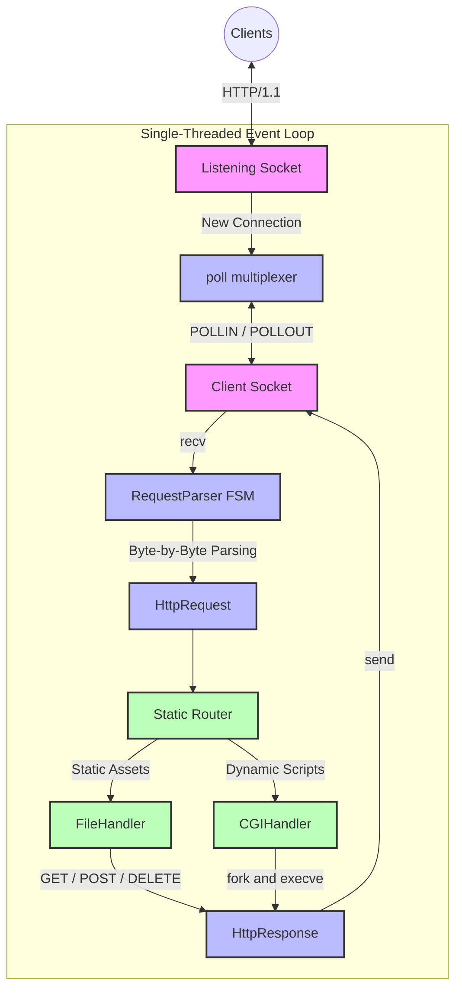

<div align="center">
  <h1>🚀 Webserv (42 Madrid)</h1>
  <p><strong>A lightweight, high-performance, and non-blocking HTTP/1.1 web server written in C++98 from scratch.</strong></p>
  
  [](https://isocpp.org/)
  [](https://42.fr/)
  [](https://valgrind.org/)
</div>

## 📌 Overview

This project is a complete reimplementation of a web server (similar to NGINX) built strictly adhering to the POSIX standard, without using any external networking libraries (no Boost, no `pthread`). 

The core challenge was to construct a fully **asynchronous, single-threaded Event Loop** capable of handling thousands of concurrent connections and routing HTTP requests seamlessly using a finite-state machine.

## 🏗 Architecture

The server is built entirely around non-blocking sockets (`O_NONBLOCK`) and multiplexed via the `poll()` system call. This prevents slow clients from stalling the server.



## ✨ Features

- **Non-blocking I/O:** Powered by a highly optimized `poll()` event loop.
- **Robust HTTP Parser:** A meticulous Finite State Machine (FSM) reading byte-by-byte to prevent OOM attacks (Anti-Slowloris defenses implemented).
- **Zero-Copy Architecture:** Pointer swapping and intelligent buffer management limit RAM usage, even when processing massive 100MB+ POST uploads simultaneously.
- **Virtual Hosting:** Support for multiple server blocks (`server_name`), host routing, and custom ports.
- **CGI Execution:** Secure execution of dynamic scripts (Python, PHP) via pipes.
- **Static File Routing:** Custom error pages, directory listing (`autoindex`), and HTTP redirections (301).
- **Leak Free:** 100% stable memory footprint validated via Valgrind under extreme Siege load tests.

## 🚀 Getting Started

### 1. Build the server
```bash
make
```

### 2. Run the server
You must pass a valid configuration file. (Example files are provided in the `conf` directory).
```bash
./webserv conf/raul.conf
```

### 3. Test it!
```bash
# Simple GET Request
curl -v http://localhost:8080/

# Test the robust POST handler
curl -v -X POST -F "file=@Makefile" http://localhost:8080/upload
```

## 🧠 Design Philosophy & Teamwork

Building this project taught us advanced system design:
- **Sergio's Focus:** Initial architectural design, developing the strict RequestParser (FSM), and memory management strategies.
- **Teammate's Focus:** Implementing the CGI executor layer, the presentation/front-end design, and HTTP routing logic.
- **Joint Effort:** We worked side-by-side on the hardest bottleneck: optimizing the `poll()` event loop. By refining the buffer ingestion and adding zero-copy semantics, we enabled our single-threaded server to survive a stress test of **40 Gigabytes of concurrent I/O** without a single memory leak.

---
*Created as part of the 42 Network Curriculum.*
